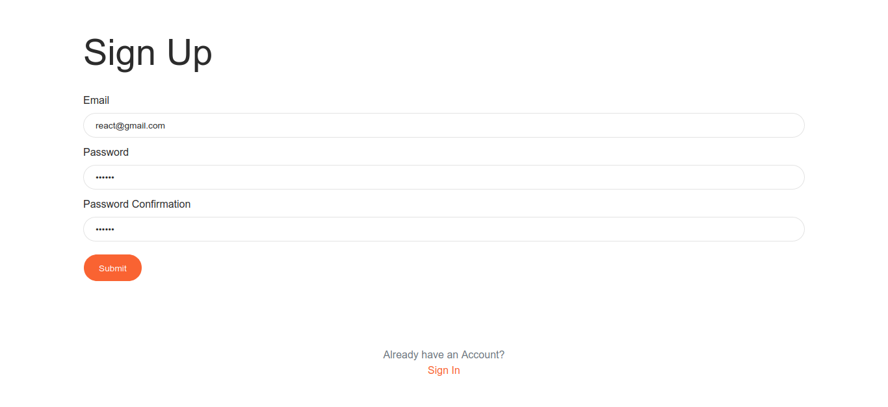
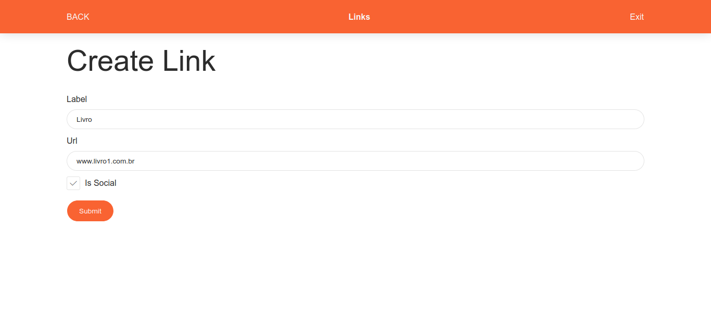
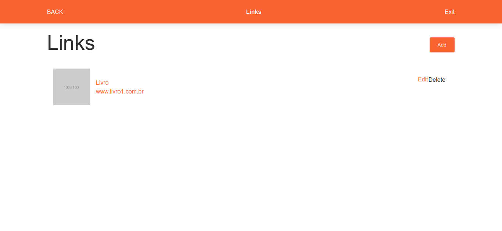
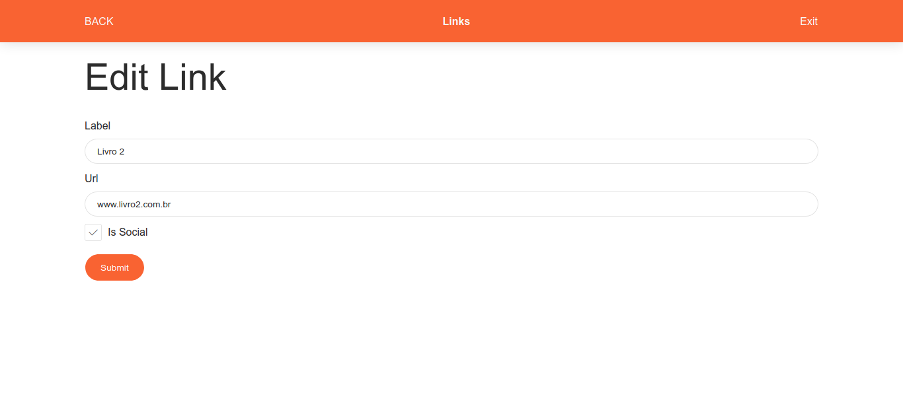
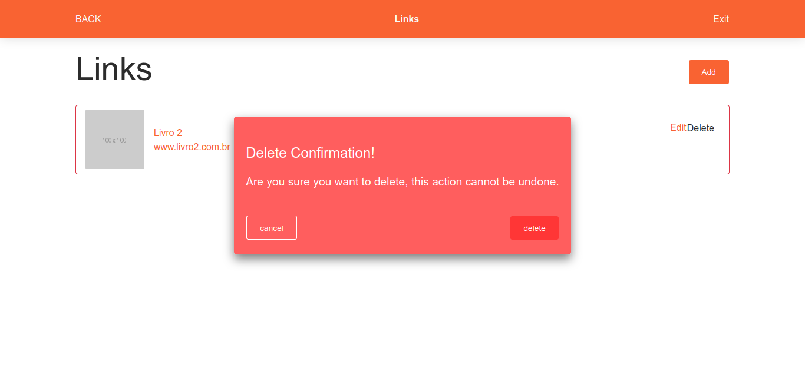

# Maratona JS
 Projeto desenvolvido durante o evento Maratona JS de Emerson Broga

# Funcionalidades
 - Cadastro de usuário em banco de dados
 - Autenticação de usuário
 - Edição de dados
 - Validação de dados
 - Refresh Token

# Principais tecnologias
 - ReactJS
 - Redux
 - Node.js
 - Sequelize
 - MySQL
 - Hapi/Joi
 - JSON WebToken